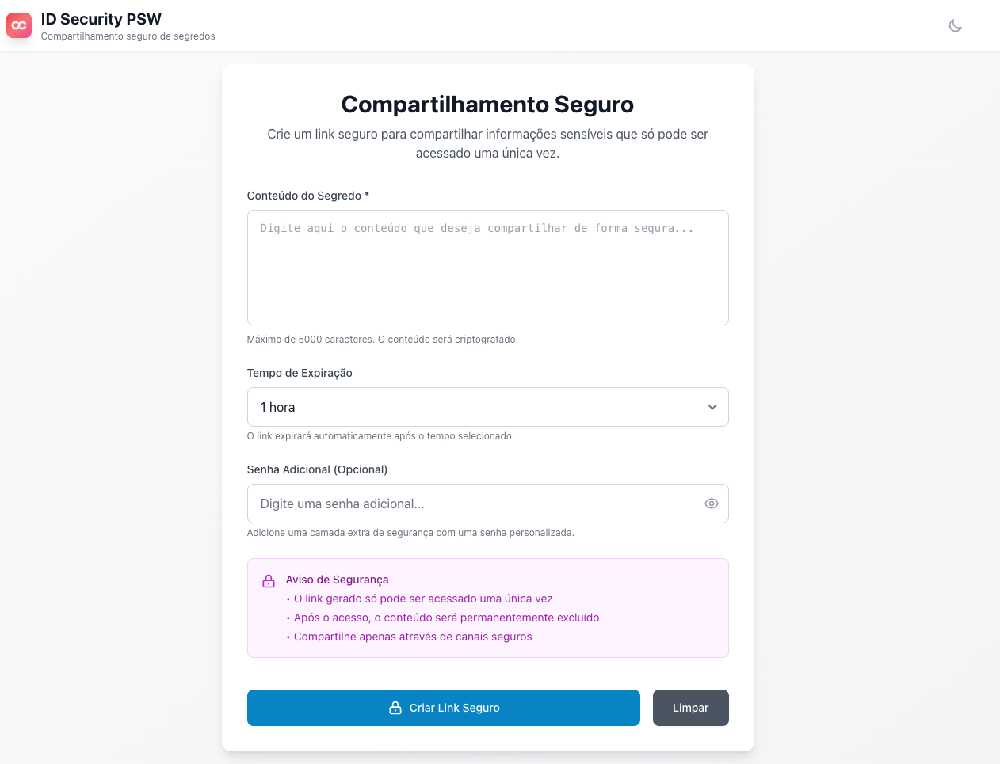

# ID Security PSW - One-Time Secret Corporate

Solução corporativa baseada no One-Time Secret com interface personalizada para compartilhamento seguro de informações sensíveis.



## 🏗️ Arquitetura

- **Backend**: One-Time Secret oficial (pglombardo/one-time-secret) + AWS ElastiCache Redis
- **Frontend**: Interface customizada com HTML + TypeScript + WindiCSS
- **Deploy**: Automático via merge na branch main

## 📁 Estrutura do Projeto

```
id-security-psw/
├── frontend/                 # Interface personalizada
│   ├── src/
│   │   ├── components/       # Componentes TypeScript modulares
│   │   ├── services/         # Comunicação com API OTS
│   │   ├── styles/          # Configurações WindiCSS
│   │   └── utils/           # Funções utilitárias
│   ├── public/              # Assets estáticos
│   └── dist/                # Build de produção
├── docker/                  # Configurações Docker
├── docker-compose.yml       # Orquestração dos serviços
├── Dockerfile.frontend      # Build do frontend
└── README.md               # Documentação
```

## 🚀 Quick Start

### Pré-requisitos
- Docker
- Docker Compose

### Desenvolvimento Local

```bash
# Clone o repositório
git clone <repository-url>
cd id-security-psw

# Iniciar backend (OTS + Redis local)
docker-compose up -d

# Em outro terminal, iniciar frontend
cd frontend
npm install
npm run dev
```

### URLs Locais

- **Frontend**: http://localhost:5173 (Vite dev server)
- **Backend OTS**: http://localhost:7143

## 🛠️ Desenvolvimento

### Frontend

```bash
# Desenvolvimento local
cd frontend
npm install
npm run dev
```

## ⚙️ Configuração

### Variáveis de Ambiente

O arquivo `.env` permite customizar:

```env
# Portas dos serviços
FRONTEND_PORT=3000
OTS_BACKEND_PORT=7143

# Configurações OTS
OTS_SECRET=your-secret-key-here
OTS_HOST=0.0.0.0

# Configurações Redis (se necessário)
REDIS_URL=redis://redis:6379
```

### Personalização da Interface

A interface pode ser customizada editando:

- **Cores e temas**: `frontend/src/styles/theme.css`
- **Componentes**: `frontend/src/components/`
- **Lógica de negócio**: `frontend/src/services/`

## 🔒 Segurança

- Comunicação entre frontend e backend via proxy reverso
- Headers de segurança configurados
- Validação de entrada em TypeScript
- Sanitização de dados sensíveis

## 🚀 Deploy

### Deploy Automático
- **Frontend**: Deploy automático via pipeline CI/CD ao fazer merge na branch `main`
- [TODO] **Backend**: Container Docker com One-Time Secret + AWS ElastiCache Redis

### Configuração Backend

```bash
# Deploy do backend OTS
docker-compose -f docker-compose.prod.yml up -d
```

### Variáveis de Ambiente

```env
# .env.prod
OTS_SECRET=your-strong-secret-key-min-32-chars
REDIS_URL=rediss://your-elasticache.amazonaws.com:6379
OTS_DOMAIN=your-domain.com
OTS_SSL=true
```
